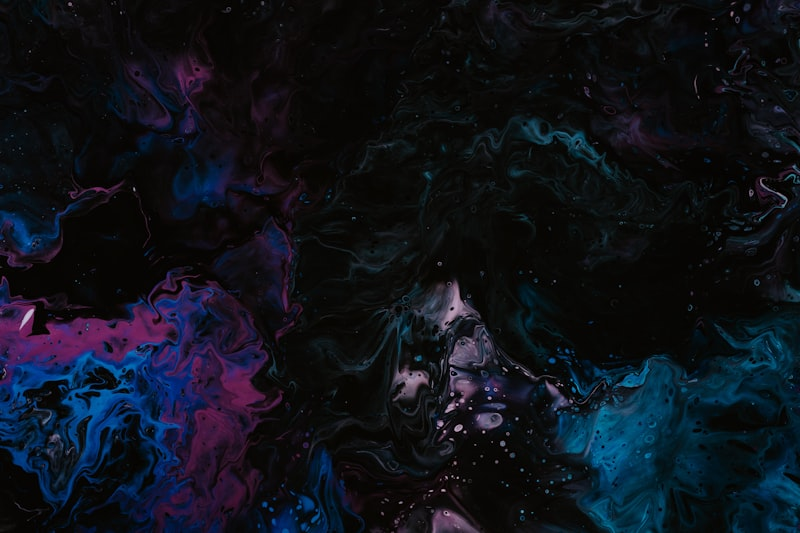
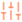

  <!-- Hero -->
  

    
3D 高斯点云编辑器

    <h1>ReSplat</h1>
    
基于 SuperSplat 重构 · 完全运行于浏览器 · 无需安装

    

      <a class="btn-primary" href="#">
         在线使用
      </a>
      <a class="btn-secondary" href="#">
         用户文档
      </a>
      <a class="btn-secondary" href="#">
         问题反馈
      </a>
    

  

  <!-- Content -->
  

    <!-- Badges row -->
    

      

        

          release
          latest
        

        

          license
          MIT
        

      

      
Powered by supersplat-2.27.0

    

    

    <!-- Intro -->
    

      

        
ReSplat 是一款基于 <strong>SuperSplat</strong> 重构的 <strong>3D 高斯点云编辑器</strong>，完全运行在浏览器中，无需安装任何软件即可使用。

      

      
本项目在 SuperSplat 的基础上 <strong>重新设计了操作逻辑</strong>，吸取了 <strong>Blender</strong> 与 <strong>Unreal Engine</strong> 的交互优点，使高斯点云的编辑体验更加直观高效。

      

        ⚠
        

          <strong>语言说明：</strong>开发者母语为中文，中文界面经过完整审核与优化。其他语言均为机器翻译、未经人工校对，欢迎社区贡献翻译改进。
        

      

    

    

    <!-- Improvements -->
    

      

        <h2 class="section-title">相比 SuperSplat 的改进</h2>
      

      
在原版基础上针对 DCC 用户重新打磨的三项核心优化

      

        

          

            
          

          <h4>操作逻辑优化</h4>
          
更符合 DCC 软件用户的操作习惯，降低上手门槛，让新用户快速融入工作流

        

        

          

            
          

          <h4>滚轮修复</h4>
          
解决了网页缩放导致滚轮失效的 Bug，确保视口操作稳定流畅

        

        

          

            
          

          <h4>深度视图</h4>
          
新增深度视图模式，方便查看场景纵深信息，辅助精确定位点云

        

      

    

    

    <!-- Features -->
    

      

        <h2 class="section-title section-title-lg">特色功能</h2>
      

      
ReSplat 在 SuperSplat 基础上新增或重构的核心能力

      <!-- Wrapper System -->
      

        

          
          <h3 class="section-title">包裹体系统</h3>
        

        

          
          

            Wrapper System
          

        

        

          ReSplat 重构了原版的选择球与选择盒，并新增了阻挡平面，三者统一称为 <strong style="color: #DCD9D4;">包裹体（Wrapper）</strong>。包裹体可以像 Mesh 一样进行移动、旋转、缩放变换，为点云选择提供灵活的空间约束能力。
        

        <table class="data-table">
          <thead>
            <tr>
              <th style="width: 90px;">包裹体</th>
              <th>说明</th>
            </tr>
          </thead>
          <tbody>
            <tr>
              <td class="name-orange">包裹球</td>
              <td>球形包裹体，选择球内的高斯点云。吸管工具、填充工具、透明度选择工具、尺寸选择工具均可限定为仅操作包裹球内的点云。例如可以在大场景中精确处理树叶内部的白色噪点。</td>
            </tr>
            <tr>
              <td class="name-amber">包裹盒</td>
              <td>盒形包裹体，功能同包裹球，形状为立方体，适合处理规则区域内的点云。</td>
            </tr>
            <tr>
              <td class="name-red">阻挡平面</td>
              <td>无限延伸的平面，可以阻挡框选工具、套索工具、多边形选择工具、画笔工具选择平面背后的高斯点云，实现前后遮挡关系下的精确选择。</td>
            </tr>
          </tbody>
        </table>
      

      <!-- Point Cloud Group -->
      

        

          
          <h3 class="section-title">点云组</h3>
        

        

          类似于 Blender 的 <strong style="color: #DCD9D4;">顶点组（Vertex Group）</strong> 概念：
        

        <ul class="feature-list">
          <li>可以将当前选择的点云保存为点云组，方便后续快速重新选择</li>
          <li>支持对点云组内的点云进行独立移动、旋转、缩放等变换操作</li>
          <li>适用于需要反复编辑同一区域点云的工作流程</li>
        </ul>
      

      <!-- Copy / Separate / Merge -->
      

        

          
          <h3 class="section-title">复制、分离、合并</h3>
        

        

          为更便捷地 <strong style="color: #DCD9D4;">拼接高斯点云</strong> 而制作的全新功能，突破了 SuperSplat 原版中深度排序对操作的限制：
        

        

          

            

              
            

            

              <h4>复制</h4>
              
复制选中的点云

            

          

          

            

              
            

            

              <h4>分离</h4>
              
将选中的点云从当前 Splat 中分离为独立对象

            

          

          

            

              
            

            

              <h4>合并</h4>
              
将多个 Splat 对象合并为一个

            

          

        

      

      <!-- Selection Tools -->
      

        

          
          <h3 class="section-title">丰富的选择工具集</h3>
        

        

          横跨三大类别的 <strong style="color: #DCD9D4;">14 种工具</strong>，覆盖选择、变换与测量的完整工作流：
        

        <table class="data-table">
          <thead>
            <tr>
              <th style="width: 100px;">类别</th>
              <th>工具</th>
            </tr>
          </thead>
          <tbody>
            <tr>
              <td class="category">选择</td>
              <td>框选 · 套索 · 多边形 · 画笔 · 填充 · 包裹球 · 包裹盒 · 吸管 · 透明度选择 · 尺寸选择</td>
            </tr>
            <tr>
              <td class="category category-amber">变换</td>
              <td>移动 · 旋转 · 缩放</td>
            </tr>
            <tr>
              <td class="category category-red">测量</td>
              <td>距离</td>
            </tr>
          </tbody>
        </table>
      

      <!-- Opacity & Size Tools -->
      

        

          
          <h3 class="section-title">透明度选择工具 &amp; 尺寸选择工具</h3>
        

        

          基于 GaussianSplatEditor 分支的源码，进行了功能衍生与增强：
        

        

          

            

              
              透明度选择.gif
            

            

              

                
                <h4>透明度选择工具</h4>
              

              
根据高斯点的透明度属性进行范围选择，快速筛选出半透明或低不透明度的点云

            

          

          

            

              
              尺寸选择.gif
            

            

              

                
                <h4>尺寸选择工具</h4>
              

              
根据高斯点的尺寸属性进行范围选择，定位过大或过小的异常点云

            

          

        

      

      <!-- Low Precision Fix -->
      

        

          
          <h3 class="section-title">低精度高斯修复</h3>
        

        
针对特定场景的修复功能：

        <ul class="feature-list">
          <li>适用于因空三（空中三角测量）受到 GPS 屏蔽器影响而导致坐标精度丢失的高斯文件</li>
          <li>修复低浮点精度的高斯点在渲染时出现的闪烁问题</li>
          <li>自动检测并修正精度异常的坐标数据</li>
        </ul>
      

      <!-- Animation & Timeline -->
      

        

          
          <h3 class="section-title">动画与时间线</h3>
        

        <ul class="feature-list">
          <li>内置时间线面板，支持关键帧动画编辑</li>
          <li>相机轨迹动画，创建平滑的飞越路径</li>
          <li>支持播放、暂停与逐帧控制</li>
        </ul>
      

      <!-- Import / Export -->
      

        

          
          <h3 class="section-title">多格式导入导出</h3>
        

        <table class="data-table" style="margin-top: 20px;">
          <thead>
            <tr>
              <th>格式</th>
              <th style="width: 124px; text-align: center;">导入</th>
              <th style="width: 124px; text-align: center;">导出</th>
            </tr>
          </thead>
          <tbody>
            <tr>
              <td>PLY（标准 / 压缩）</td>
              <td class="check">✓</td>
              <td class="check">✓</td>
            </tr>
            <tr>
              <td>Splat</td>
              <td class="check">✓</td>
              <td class="check">✓</td>
            </tr>
            <tr>
              <td>SOG</td>
              <td class="check">✓</td>
              <td class="check">✓</td>
            </tr>
            <tr>
              <td>SSPROJ（项目文件）</td>
              <td class="check">✓</td>
              <td class="check">✓</td>
            </tr>
            <tr>
              <td>图像（PNG / WebP）</td>
              <td class="dash">—</td>
              <td class="check">✓</td>
            </tr>
            <tr>
              <td>视频（MP4 / WebM / MOV / MKV）</td>
              <td class="dash">—</td>
              <td class="check">✓</td>
            </tr>
          </tbody>
        </table>
      

      <!-- Multi-language -->
      

        

          
          <h3 class="section-title">多语言支持</h3>
        

        
基于 i18next 的国际化系统，支持 9 种语言：

        

          中文（简体）
          English
          日本語
          한국어
          Français
          Deutsch
          Español
          Português
          Русский
        

      

    

    

    <!-- i18n Contribution -->
    

      <h2 class="section-title section-title-lg" style="padding-left: 18px; border-left: 3px solid #A94804;">国际化贡献</h2>
      
欢迎帮助改进翻译质量！

      <ol class="num-list">
        <li>
          1
          在 static/locales/ 目录下找到对应语言的 JSON 文件
        </li>
        <li>
          2
          修改或补充翻译内容
        </li>
        <li>
          3
          如需新增语言，在 static/locales/ 中添加 &lt;locale&gt;.json 文件，并在 src/ui/localization.ts 中注册
        </li>
      </ol>
      

        测试翻译：启动开发服务器后访问 http://localhost:3000/?lng=&lt;locale&gt;（如 ?lng=zh-CN）
      

    

    

    <!-- Thanks -->
    

      <h2 class="section-title section-title-lg" style="padding-left: 18px; border-left: 3px solid #A94804;">致谢</h2>
      

        

          
          <a href="https://github.com/playcanvas/super-splat">SuperSplat</a>
          —
          原始项目，提供了强大的高斯点云编辑基础
        

        

          
          <a href="https://github.com/Shachaf-zz/GaussianSplatEditor">GaussianSplatEditor</a>
          —
          透明度 / 尺寸选择工具的源码参考
        

        

          
          <a href="https://playcanvas.com">PlayCanvas</a>
          —
          优秀的 WebGL 游戏引擎
        

      

    

    

    <!-- Footer -->
    

      
本项目基于 <strong>MIT License</strong> 开源发布

      
A fork of SuperSplat · Powered by PlayCanvas

    

  

