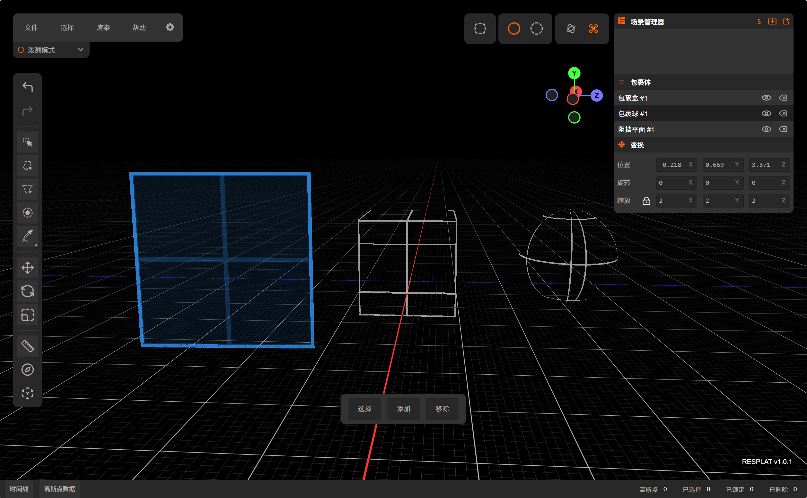
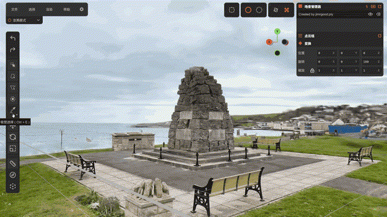
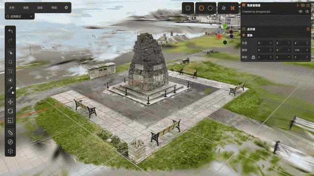

# ReSplat Editor

> **Powered by** **[SuperSplat](https://github.com/playcanvas/supersplat)** — This project is a fork/rebrand of the original SuperSplat editor.

| [在线使用](https://re-qi.github.io/ReSplat_Editor/) | [用户文档](https://developer.playcanvas.com/user-manual/gaussian-splatting/editing/ReSplat/) | [问题反馈](https://github.com/Re-qi/ReSplat_Editor/issues) |
| :------------------------------------------------: | :------------------------------------------------------------------------------------------: | :--------------------------------------------------------: |

## 目录

- [简介](#简介)
- [相比 SuperSplat 的改进](#相比-supersplat-的改进)
- [特色功能](#特色功能)
- [国际化贡献](#国际化贡献)
- [致谢](#致谢)
- [许可证](#许可证)

***

## 简介

ReSplat 是一款基于 [SuperSplat](https://github.com/playcanvas/supersplat) 重构的 **3D 高斯点云编辑器**，可以运行在浏览器中。

本项目在 SuperSplat 的基础上**重新设计了操作逻辑**，吸取了 **Blender** 与 **Unreal Engine** 的交互优点，使高斯点云的编辑体验更加直观高效。

> **语言说明**：开发者母语为中文，因此**中文界面经过完整审核与优化**，其他语言均为机器翻译、未经人工校对，欢迎社区贡献翻译改进。

***

## 相比 SuperSplat 的改进

在 SuperSplat 的基础上，ReSplat 做了以下改进：

- **操作逻辑优化**：更符合 DCC 软件用户的操作习惯，降低上手门槛
- **性能优化**：本地部署性能更强，复杂计算后端程序运行，不必全部交给前端
- **Lcc编辑功能**：Lcc文件可以直接导入，编辑多lod，导出多lod，无lod的文件自动创建lod

***

## 特色功能

### 包裹体系统

ReSplat 重构了原版的选择球与选择盒，并新增了阻挡平面，三者统一称为 **包裹体（Wrapper）**。包裹体可以像 Mesh 一样进行移动、旋转、缩放变换，为点云选择提供了灵活的空间约束能力。

| 包裹体      | 说明                                                                              |
| -------- | ------------------------------------------------------------------------------- |
| **包裹球**  | 球形包裹体，选择球内的高斯点云。吸管工具、填充工具、透明度选择工具、尺寸选择工具均可限定为仅操作包裹球内的点云。例如可以在大场景中精确处理树叶内部的白色噪点。 |
| **包裹盒**  | 盒形包裹体，功能同包裹球，形状为立方体，适合处理规则区域内的点云。                                               |
| **阻挡平面** | 无限延伸的平面，可以阻挡框选工具、套索工具、多边形选择工具、画笔工具选择平面**背后**的高斯点云，实现前后遮挡关系下的精确选择。               |

### 点云组

类似于 Blender 的 **顶点组（Vertex Group）** 概念：

- 可以将当前选择的点云**保存为点云组**，方便后续快速重新选择
- 支持对点云组内的点云进行**独立移动、旋转、缩放**等变换操作
- 适用于需要反复编辑同一区域点云的工作流程

### 复制、分离、合并

为更便捷地**拼接高斯点云**而制作的全新功能，突破了 SuperSplat 原版中深度排序对操作的限制：

- **复制** — 复制选中的点云
- **分离** — 将选中的点云从当前 Splat 中分离为独立对象
- **合并** — 将多个 Splat 对象合并为一个

### 透明度选择工具 & 尺寸选择工具

基于 [GaussianSplatEditor](https://github.com/TimChen1383/GaussianSplatEditor) 分支的源码，进行了功能衍生与增强：

- **透明度选择工具** — 根据高斯点的透明度属性进行范围选择，快速筛选出半透明或低不透明度的点云
  
- **尺寸选择工具** — 根据高斯点的尺寸属性进行范围选择，定位过大或过小的异常点云
  

### 低精度高斯修复

针对特定场景的修复功能：

- 适用于因空三（空中三角测量）受到 **GPS 屏蔽器**影响而导致坐标精度丢失的高斯文件
- 修复低浮点精度的高斯点在渲染时出现的**闪烁问题**
- 自动检测并修正精度异常的坐标数据

### 多语言支持

基于 i18next 的国际化系统，支持 9 种语言：

中文（简体） · English · 日本語 · 한국어 · Français · Deutsch · Español · Português · Русский

***

## 国际化贡献

欢迎帮助改进翻译质量！

1. 在 `static/locales/` 目录下找到对应语言的 JSON 文件
2. 修改或补充翻译内容
3. 如需新增语言，在 `static/locales/` 中添加 `<locale>.json` 文件，并在 `src/ui/localization.ts` 中注册

测试翻译：启动开发服务器后访问 `http://localhost:3000/?lng=<locale>`（如 `?lng=zh-CN`）

***

## 致谢

- [SuperSplat](https://github.com/playcanvas/supersplat) — 原始项目，提供了强大的高斯点云编辑基础
- [GaussianSplatEditor](https://github.com/TimChen1383/GaussianSplatEditor) — 透明度/尺寸选择工具的源码参考
- [PlayCanvas](https://playcanvas.com/) — 优秀的 WebGL 游戏引擎

***

## 许可证

本项目基于 [MIT License](./LICENSE) 开源。
